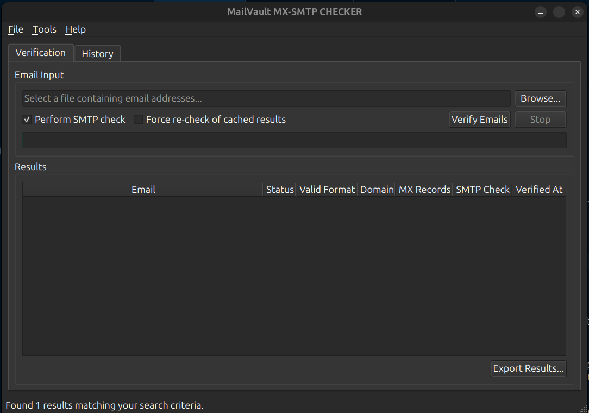

# MailVault MX-SMTP CHECKER

A desktop application for verifying email address validity through format checking, DNS verification, and SMTP testing.



## Features

- **Email Format Validation**: Checks if email addresses follow RFC 5322 standards
- **DNS Verification**: Validates domain MX records
- **SMTP Testing**: Connects to mail servers to verify mailbox existence
- **Batch Processing**: Import and verify lists of email addresses from files
- **Result Management**: Store, search, and filter verification results
- **Export Capability**: Export results to CSV format

## Installation

### Prerequisites

- Python 3.8 or higher
- PyQt6
- dnspython

### Setup

1. Clone the repository:

   ```
   git clone https://github.com/OnlyKH/email-verifier.git
   cd email-verifier
   ```

2. Create a virtual environment (recommended):

   ```
   python -m venv venv
   source venv/bin/activate  # On Windows: venv\Scripts\activate
   ```

3. Install dependencies:

   ```
   pip install -r requirements.txt
   ```

4. Run the application:
   ```
   python main.py
   ```

## Usage

### Verifying Email Addresses

1. **Single Email Verification**:

   - Go to Tools → Verify Single Email
   - Enter an email address and click OK
   - View the detailed verification results

2. **Batch Verification**:
   - Click "Browse..." to select a file containing email addresses (one per line)
   - Select verification options (SMTP check, force re-check)
   - Click "Verify Emails" to start the process
   - Monitor progress in the progress bar

### Managing Results

- View verification history in the "History" tab
- Search for specific emails or domains
- Filter by verification status (Deliverable/Undeliverable)
- Export results to CSV files for further analysis

## How It Works

MailVault MX-SMTP CHECKER uses a multi-stage verification process:

1. **Format Validation**: Checks if the email follows standard format using regex
2. **Domain Checking**: Extracts and verifies the email domain
3. **MX Record Validation**: Queries DNS to verify domain has mail servers
4. **SMTP Verification**: If enabled, connects to mail servers to check if the mailbox exists

Results are stored in a local SQLite database for future reference and faster repeat verification.

## Project Structure

```
email-verifier/
├── email_verifier/           # Main package
│   ├── core/                 # Core verification logic
│   │   ├── database.py       # Database operations
│   │   └── verifier.py       # Email verification engine
│   ├── models/               # Data models
│   │   └── verification.py   # Verification result model
│   ├── ui/                   # User interface
│   │   ├── main_window.py    # Main application window
│   │   └── result_table.py   # Results display component
│   └── utils/                # Utilities
│       └── file_utils.py     # File handling functions
├── main.py                   # Application entry point
└── requirements.txt          # Project dependencies
```

## License

[MIT License](LICENSE)

## Contributing

Contributions are welcome! Please feel free to submit a Pull Request.

1. Fork the repository
2. Create your feature branch (`git checkout -b feature/amazing-feature`)
3. Commit your changes (`git commit -m 'Add some amazing feature'`)
4. Push to the branch (`git push origin feature/amazing-feature`)
5. Open a Pull Request

## Acknowledgements

- [PyQt6](https://www.riverbankcomputing.com/software/pyqt/) for the UI framework
- [dnspython](https://www.dnspython.org/) for DNS resolution capabilities
